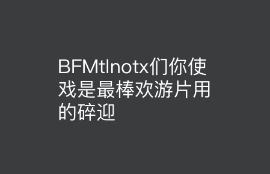

# BMFontToolbox

**BMFontToolbox** 支持两种合成方式：

-   图集模式

-   字体模式

## 一、图集模式

> 在图集模式下，用户可以直接拖入规范的图片字，然后导出即可。

-   拖入图片字

-   按 `文件->导出` 或者 `Ctrl+E` 可以生成结果：

-   注意事项

## 二、字体模式

> 在字体模式下，用户只需要输入字符，然后导出即可。
>
> 需要注意的是，当前**只支持 TrueType 字体**。
>
> 另外，**可选择使用系统字体或自选字体**，完全看用户的需要。

-   选择字体，输入字符

-   导出：`文件->导出` 或者 `Ctrl+E` 可以生成结果：

